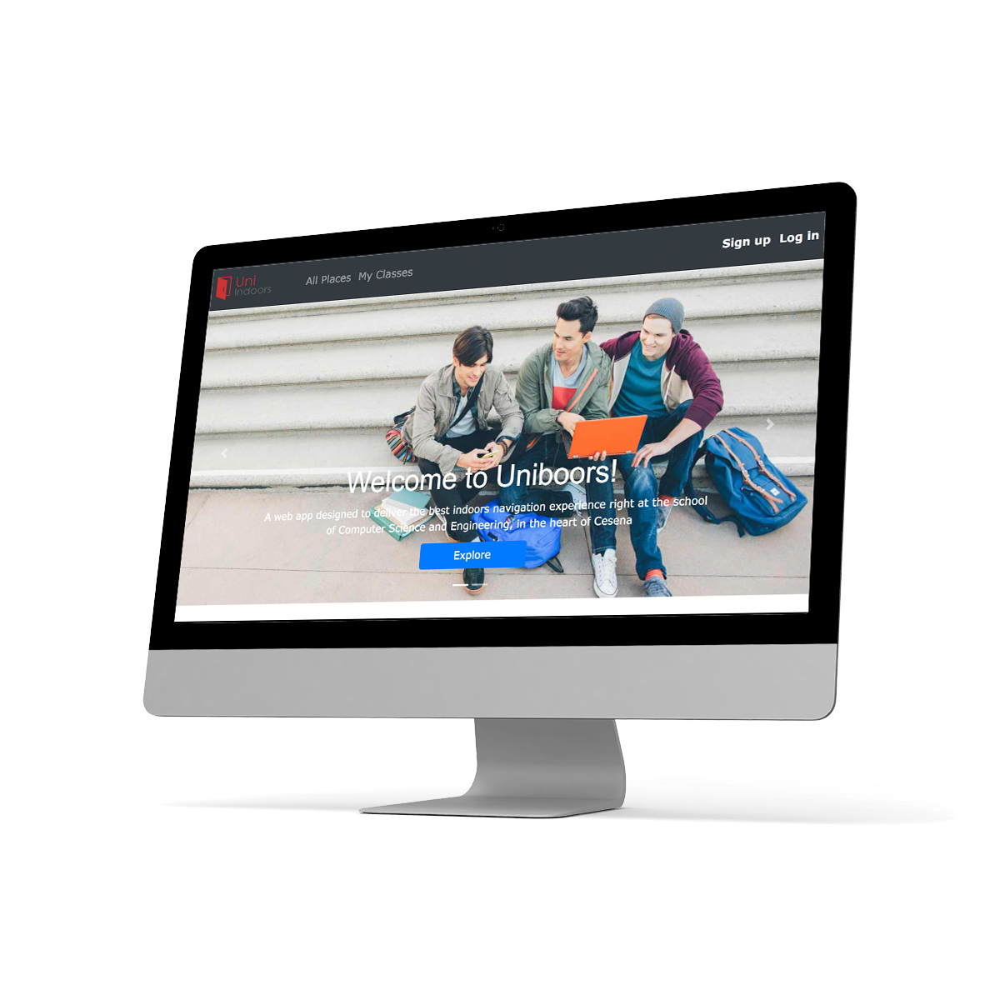
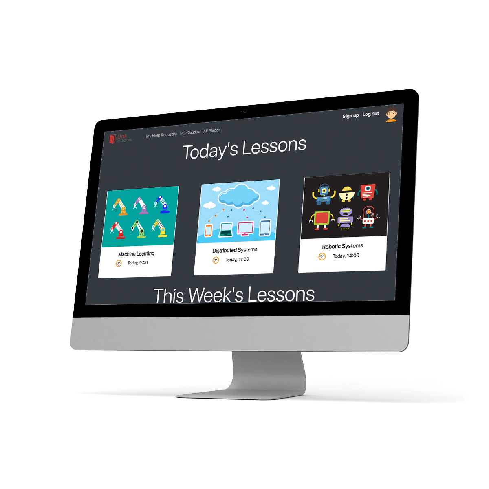
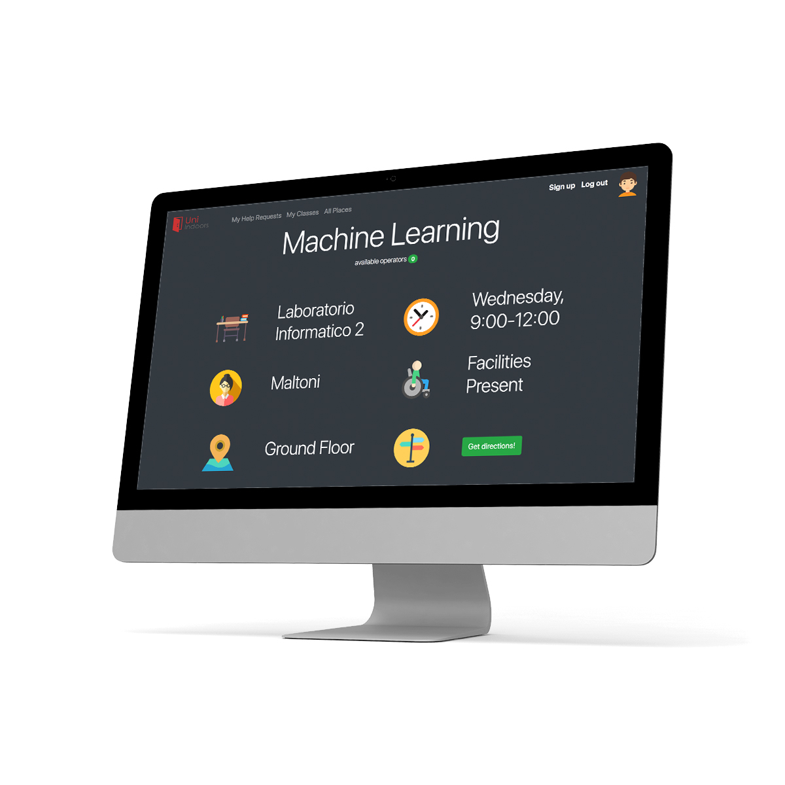
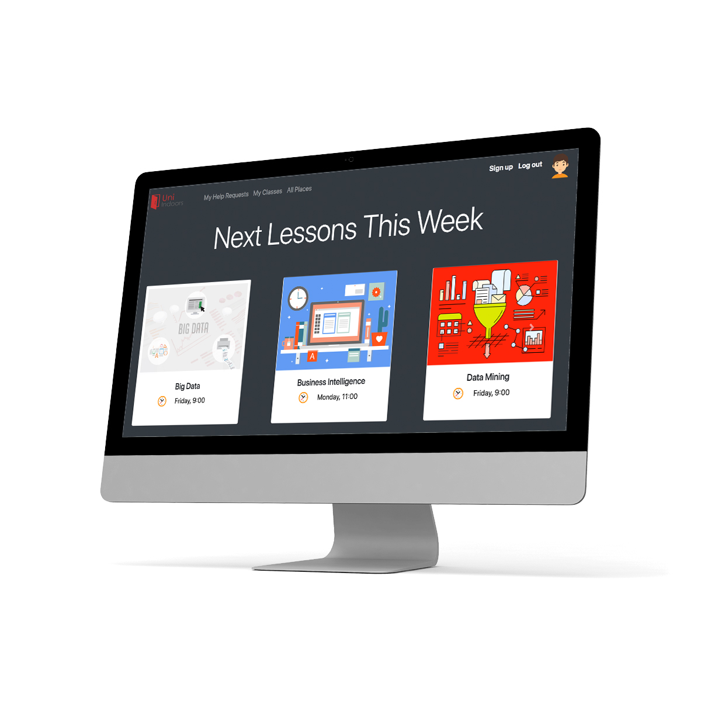
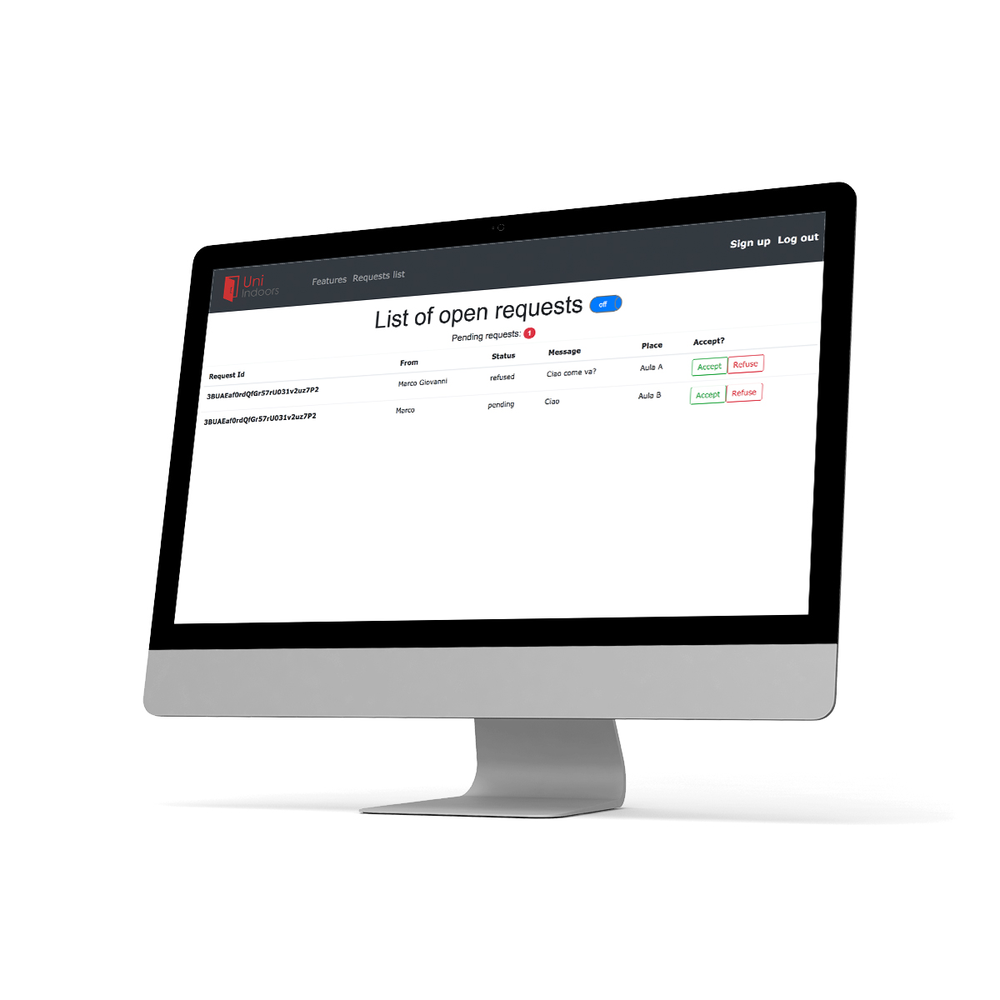

## UnIndoors

A web app system to manage lessons, hours at your own University. The system will show your daily schedule, given details such as teacher, room and subject.

UnIndoors is the final project for the course of [Web Services and Application](http://www.engineeringarchitecture.unibo.it/en/programmes/course-unit-catalogue/course-unit/2016/412604), held at AMS [University of Bologna](http://www.unibo.it) during the academic year 2016/17.

### Getting Started

Clone the repo, change the parameters into the file connector.js.

### Prerequisites ###

Create a new Firebase project in order to get the API key to connect to you own Firebase database. After that, data will be stored in there.
 
### Editing ###

Just open the file index.html using one of your favourite IDE.

### Android app ###
The related Android app is available at [Uniboors](https://github.com/giacomobartoli/Uniboors) repository.
 
## Screenshots ##
 

## Developers ##
Made with ❤️ by:

 - Giacomo "the Oracle" Zanotti
 - Giacomo Bartoli, the official Commesso &copy;

